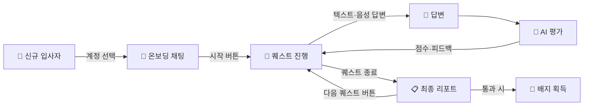
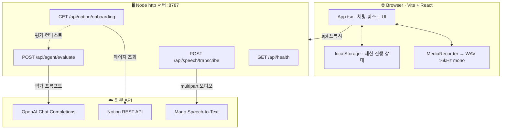
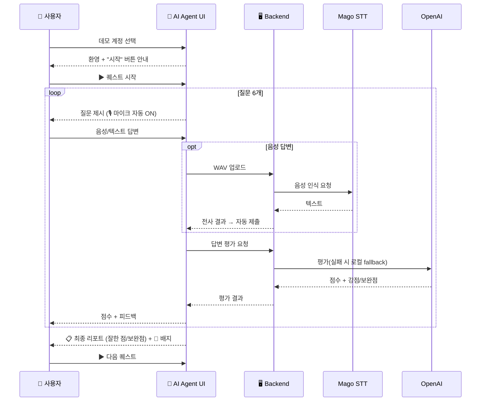

# 🎧 Mago 온보딩 음성 AI Agent 데모

<p align="center">
  
  
  
  
  
  
  
  
</p>

> Mago 신규 입사자를 위한 **온보딩 음성 AI Agent** 데모 서비스입니다.
> 신규 입사자가 웹에서 데모 계정을 선택하면, AI Agent가 온보딩 퀘스트를 제시하고
> 사용자는 **텍스트 또는 음성**으로 답변합니다. 답변은 OpenAI(또는 로컬 fallback)로
> 평가되며, 퀘스트를 완료하면 **최종 평가 리포트 · 배지 · 진행률**을 보여줍니다.

## ✨ 한눈에 보기



신규 입사자는 퀘스트마다 **시작 버튼**으로 대화를 열고, 6개 질문을 끝내면
**잘한 점 / 보완할 점**을 정리한 최종 리포트와 배지를 받습니다. 다음 퀘스트는
**다음 퀘스트 버튼**을 눌러야 진행됩니다.

## 데모 기능

- 데모 계정 선택 화면 (4개 계정)
- 대화형 온보딩 화면 (퀘스트 / 질문 번호 / 점수 / 진행률 / 배지)
- **퀘스트별 시작 · 다음 퀘스트 버튼**으로 진행 제어
- **퀘스트 종료 시 최종 평가 리포트** (점수 · 배지 · 잘한 점 · 보완할 점)
- 텍스트 답변 입력
- 브라우저 `MediaRecorder` 녹음 → **16kHz / 16-bit / mono WAV** 변환 → Mago Speech-to-Text
- 새 질문 시 마이크 자동 시작 + 음성 인식 후 자동 제출
- OpenAI Chat Completions 평가 + 로컬 fallback 평가
- Notion 온보딩 문서를 평가 컨텍스트로 사용
- `localStorage` 진행 상태 저장 (새로고침해도 이어서 진행)

## 기술 스택

- **Frontend**: Vite + React + TypeScript
- **Backend**: Node.js 내장 `http` 서버 (외부 의존성 없음)
- **오디오 인코딩**: Web Audio API 로 브라우저에서 16kHz/16-bit/mono WAV 변환 (외부 라이브러리 불필요)
- **Speech-to-Text**: Mago Speech-to-Text API (API key 불필요)
- **AI 평가**: OpenAI Chat Completions API
- **Notion**: REST API로 온보딩 문서 조회 (평가 컨텍스트 전용)
- **상태 저장**: 데모에서는 `localStorage`

## 🏗️ 아키텍처

브라우저(React)는 Vite dev 서버의 `/api` 프록시를 통해 Node `http` 백엔드와
통신하고, 백엔드는 외부 API(Mago STT / OpenAI / Notion)를 중계합니다.
오디오 인코딩(16kHz WAV)과 퀘스트 정의는 **프론트엔드**에 있습니다.



## 🔁 퀘스트 진행 흐름



## 빠른 시작

### 1. 의존성 설치

```bash
npm install
```

### 2. 환경 변수 설정

```bash
cp .env.example .env
```

`.env` 를 열어 값을 채웁니다. **키가 없어도 데모는 동작합니다**
(OpenAI 미설정 시 로컬 fallback 평가, Notion 미설정 시 컨텍스트 없이 평가).

### 3. Backend 실행

```bash
npm run dev:server
```

`http://localhost:8787` 에서 backend가 실행됩니다.

### 4. Frontend 실행 (다른 터미널)

```bash
npm run dev
```

`http://localhost:5173` 에서 데모를 엽니다. Vite가 `/api` 요청을
`http://localhost:8787` backend로 프록시합니다.

## 환경 변수

| 변수 | 설명 | 기본값 |
| --- | --- | --- |
| `PORT` | Backend 포트 | `8787` |
| `OPENAI_API_KEY` | OpenAI API 키 (없으면 로컬 fallback) | (빈 값) |
| `OPENAI_MODEL` | OpenAI 모델 | `gpt-4o-mini` |
| `MAGO_SPEECH_TO_TEXT_RUN_URL` | Mago STT 실행 endpoint | `https://api.magovoice.com/speech_to_text/v1/run` |
| `NOTION_API_KEY` | Notion 통합 토큰 (없으면 컨텍스트 미사용) | (빈 값) |
| `NOTION_ONBOARDING_PAGE_ID` | Notion 온보딩 페이지 ID | `ae8d12a9bd374426901bf0bd991316c8` |
| `NOTION_VERSION` | Notion API 버전 | `2022-06-28` |
| `NOTION_CONTEXT_TTL_MS` | Notion 컨텍스트 캐시 TTL(ms) | `60000` |

> 실제 키는 `.env` 에서만 읽고, 저장소에는 `.env.example` 의 placeholder만 둡니다.

## Backend API

| Method | Path | 설명 |
| --- | --- | --- |
| `GET` | `/api/health` | OpenAI / STT / Notion 설정 상태 반환 |
| `POST` | `/api/agent/evaluate` | 답변을 OpenAI로 평가 (실패 시 로컬 fallback) |
| `POST` | `/api/speech/transcribe` | 오디오를 Mago STT로 변환 (multipart/form-data 프록시) |
| `GET` | `/api/notion/onboarding` | Notion 온보딩 문서를 plain text로 반환 |

> `/api/notion/quests` endpoint는 **존재하지 않습니다.** 퀘스트는 프론트엔드 코드에
> 포함되어 있고, Notion은 평가 컨텍스트로만 사용합니다.

### `/api/health` 확인

```bash
curl http://localhost:8787/api/health
```

### Notion 연결 확인

```bash
curl http://localhost:8787/api/notion/onboarding
```

## 검증 명령

```bash
node --check server/index.js     # backend 문법 검사
./node_modules/.bin/tsc -b       # TypeScript 타입 검사
./node_modules/.bin/vite build   # 프로덕션 빌드
```

`npm run build` 로 타입 검사 + 빌드를 한 번에 실행할 수 있습니다.

## 데모 시나리오

1. 데모 계정을 선택합니다.
2. 퀘스트 목록의 **`▶ 시작`** 버튼을 눌러 Quest 1을 시작합니다.
3. Agent가 첫 질문을 제시하면 🎙️ 마이크가 자동으로 켜집니다.
4. 텍스트로 답하거나 음성으로 답변합니다. (음성은 인식 후 자동 제출)
5. 답변이 평가되어 점수(0/1/2)와 피드백이 표시됩니다.
6. 6개 질문을 마치면 **최종 평가 리포트**(점수 · 잘한 점 · 보완할 점 · 배지)가 나옵니다.
7. **`▶ 다음 퀘스트`** 버튼을 눌러 다음 퀘스트를 진행합니다.
8. 3개 퀘스트를 모두 마치면 진행률, 획득 배지, 대화 기록을 확인합니다.

> "예시 보기" 버튼으로 모범 답안을 입력란에 채워 빠르게 시연할 수 있습니다.

## 문제 해결

| 증상 | 원인 / 해결 |
| --- | --- |
| 평가 점수가 항상 "로컬 평가"로 표시됨 | `OPENAI_API_KEY` 미설정 또는 OpenAI 호출 실패. `.env` 확인 후 backend 재시작 |
| 음성 버튼이 동작하지 않음 | 브라우저 마이크 권한 거부 또는 미지원. 텍스트 입력으로 계속 진행 가능 |
| STT 결과가 비어 있음 | 무음/너무 짧은 녹음이거나 디코드 실패. 더 또렷이 말한 뒤 재시도하거나 텍스트 입력으로 진행 |
| Notion 컨텍스트가 비어 있음 | `NOTION_API_KEY` 미설정 또는 페이지에 integration이 공유되지 않음 |
| `/api` 요청 404 | backend(`npm run dev:server`)가 실행 중인지 확인 |

## 프로젝트 구조

```
.
├── index.html
├── package.json
├── vite.config.ts            # /api -> localhost:8787 프록시
├── tsconfig.json / tsconfig.app.json
├── .env.example              # 환경 변수 예시 (placeholder)
├── server/
│   └── index.js              # Node http backend (env loader 포함)
├── src/
│   ├── main.tsx
│   ├── App.tsx               # 메인 UI / 상태 관리
│   ├── quests.ts             # 데모 계정 + 기본 퀘스트 3개
│   ├── evaluation.ts         # 로컬 fallback 평가
│   ├── api.ts                # evaluate / transcribe 호출
│   ├── audio.ts              # 녹음 디코드/리샘플 (16kHz mono)
│   ├── wav.ts                # 16kHz/16bit/mono WAV 인코딩
│   ├── useRecorder.ts        # MediaRecorder 훅
│   ├── types.ts
│   └── styles.css
├── coding_guideline.md
├── prompts.md
└── prompt_log.md
```

## 관련 자료

- Mago 홈페이지: https://www.holamago.com/
- Mago Voice 문서: https://docs.magovoice.com/
- Mago Service API Reference: https://mago-1.gitbook.io/mago-service-api-reference
- Mago Speech-to-Text 문서: https://api.magovoice.com/speech_to_text/docs
