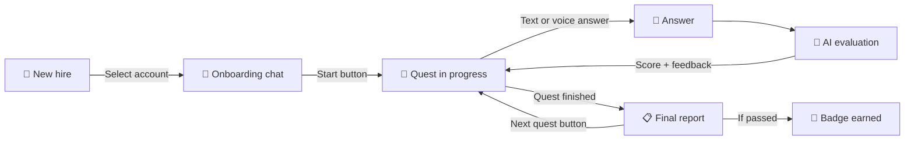
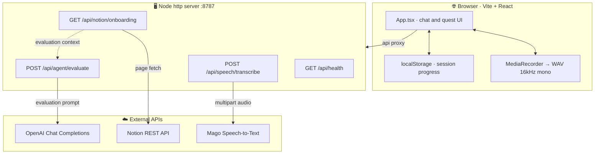
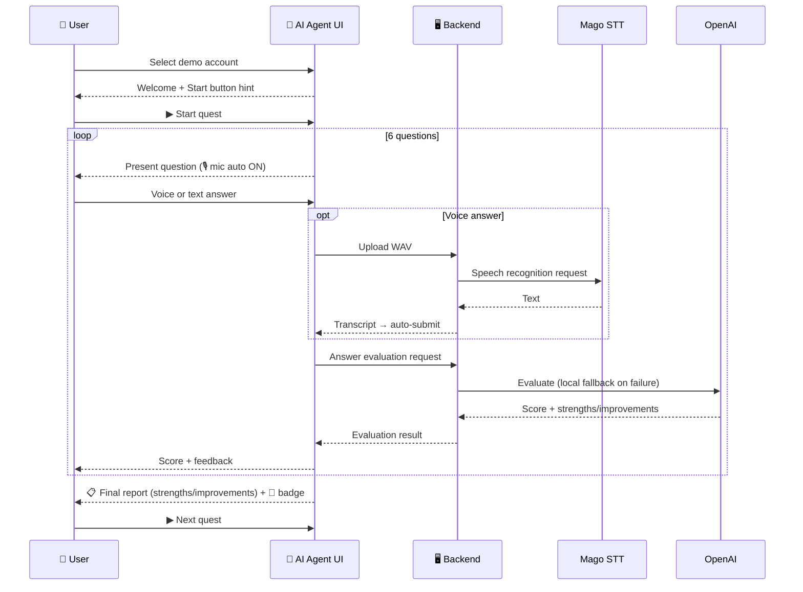

# 🎧 Mago Onboarding Voice AI Agent Demo

<p align="center">
  
  
  
  
  
  
  
  
</p>

> A demo **onboarding voice AI agent** service for new Mago employees.
> A new hire picks a demo account in the browser, the AI agent presents onboarding
> quests, and the user answers by **text or voice**. Answers are evaluated by
> OpenAI (or a local fallback), and finishing a quest shows a
> **final evaluation report, badges, and progress**.

## ✨ At a Glance



For each quest the new hire opens the conversation with a **Start button**, and after
finishing the 6 questions they receive a final report summarizing
**strengths / areas to improve**, plus a badge. The next quest only proceeds when the
**Next Quest button** is pressed.

## Demo Features

- Demo account selection screen (4 accounts)
- Conversational onboarding screen (quest / question number / score / progress / badges)
- **Per-quest Start and Next Quest buttons** to control progression
- **Final evaluation report at the end of each quest** (score, badge, strengths, areas to improve)
- Text answer input
- Browser `MediaRecorder` recording → **16kHz / 16-bit / mono WAV** conversion → Mago Speech-to-Text
- Microphone auto-starts on a new question + auto-submit after speech recognition
- OpenAI Chat Completions evaluation + local fallback evaluation
- Uses Notion onboarding docs as evaluation context
- `localStorage` progress persistence (resumes after a page refresh)

## Tech Stack

- **Frontend**: Vite + React + TypeScript
- **Backend**: Node.js built-in `http` server (no external dependencies)
- **Audio encoding**: 16kHz/16-bit/mono WAV conversion in the browser via the Web Audio API (no external libraries needed)
- **Speech-to-Text**: Mago Speech-to-Text API (no API key required)
- **AI evaluation**: OpenAI Chat Completions API
- **Notion**: REST API to fetch onboarding docs (evaluation context only)
- **State persistence**: `localStorage` for the demo

## 🏗️ Architecture

The browser (React) talks to the Node `http` backend through the Vite dev server's
`/api` proxy, and the backend relays calls to external APIs (Mago STT / OpenAI / Notion).
Audio encoding (16kHz WAV) and quest definitions live in the **frontend**.



## 🔁 Quest Flow



## Quick Start

### 1. Install dependencies

```bash
npm install
```

### 2. Configure environment variables

```bash
cp .env.example .env
```

Open `.env` and fill in the values. **The demo works even without keys**
(without OpenAI it uses the local fallback evaluation; without Notion it evaluates
with no context).

### 3. Run the backend

```bash
npm run dev:server
```

The backend runs at `http://localhost:8787`.

### 4. Run the frontend (in another terminal)

```bash
npm run dev
```

Open the demo at `http://localhost:5173`. Vite proxies `/api` requests to the
`http://localhost:8787` backend.

## Environment Variables

| Variable | Description | Default |
| --- | --- | --- |
| `PORT` | Backend port | `8787` |
| `OPENAI_API_KEY` | OpenAI API key (local fallback if unset) | (empty) |
| `OPENAI_MODEL` | OpenAI model | `gpt-4o-mini` |
| `MAGO_SPEECH_TO_TEXT_RUN_URL` | Mago STT run endpoint | `https://api.magovoice.com/speech_to_text/v1/run` |
| `NOTION_API_KEY` | Notion integration token (no context if unset) | (empty) |
| `NOTION_ONBOARDING_PAGE_ID` | Notion onboarding page ID | `ae8d12a9bd374426901bf0bd991316c8` |
| `NOTION_VERSION` | Notion API version | `2022-06-28` |
| `NOTION_CONTEXT_TTL_MS` | Notion context cache TTL (ms) | `60000` |

> Real keys are read only from `.env`; the repository keeps only the placeholders in `.env.example`.

## Backend API

| Method | Path | Description |
| --- | --- | --- |
| `GET` | `/api/health` | Returns OpenAI / STT / Notion configuration status |
| `POST` | `/api/agent/evaluate` | Evaluates an answer with OpenAI (local fallback on failure) |
| `POST` | `/api/speech/transcribe` | Converts audio with Mago STT (multipart/form-data proxy) |
| `GET` | `/api/notion/onboarding` | Returns the Notion onboarding doc as plain text |

> The `/api/notion/quests` endpoint **does not exist.** Quests are bundled in the
> frontend code, and Notion is used only as evaluation context.

### Check `/api/health`

```bash
curl http://localhost:8787/api/health
```

### Check the Notion connection

```bash
curl http://localhost:8787/api/notion/onboarding
```

## Verification Commands

```bash
node --check server/index.js     # backend syntax check
./node_modules/.bin/tsc -b       # TypeScript type check
./node_modules/.bin/vite build   # production build
```

`npm run build` runs the type check and build together.

## Demo Scenario

1. Select a demo account.
2. Press the **`▶ Start`** button in the quest list to begin Quest 1.
3. When the agent presents the first question, the 🎙️ microphone turns on automatically.
4. Answer by text or voice. (Voice answers are auto-submitted after recognition.)
5. The answer is evaluated and a score (0/1/2) and feedback are shown.
6. After finishing the 6 questions, a **final evaluation report** appears (score, strengths, areas to improve, badge).
7. Press the **`▶ Next Quest`** button to continue to the next quest.
8. After completing all 3 quests, review the progress, earned badges, and conversation history.

> Use the "Show example" button to fill the input with a model answer for a quick demo.

## Troubleshooting

| Symptom | Cause / Fix |
| --- | --- |
| Score always shows "local evaluation" | `OPENAI_API_KEY` is unset or the OpenAI call failed. Check `.env` and restart the backend |
| Voice button does not work | Browser mic permission denied or unsupported. You can keep going with text input |
| STT result is empty | Silent/too short recording or decode failure. Speak more clearly and retry, or use text input |
| Notion context is empty | `NOTION_API_KEY` is unset or the integration is not shared with the page |
| `/api` requests return 404 | Make sure the backend (`npm run dev:server`) is running |

## Project Structure

```
.
├── index.html
├── package.json
├── vite.config.ts            # proxies /api -> localhost:8787
├── tsconfig.json / tsconfig.app.json
├── .env.example              # environment variable example (placeholders)
├── server/
│   └── index.js              # Node http backend (includes env loader)
├── src/
│   ├── main.tsx
│   ├── App.tsx               # main UI / state management
│   ├── quests.ts             # demo accounts + 3 default quests
│   ├── evaluation.ts         # local fallback evaluation
│   ├── api.ts                # evaluate / transcribe calls
│   ├── audio.ts              # recording decode/resample (16kHz mono)
│   ├── wav.ts                # 16kHz/16-bit/mono WAV encoding
│   ├── useRecorder.ts        # MediaRecorder hook
│   ├── types.ts
│   └── styles.css
├── coding_guideline.md
├── prompts.md
└── prompt_log.md
```

## Resources

- Mago homepage: https://www.holamago.com/
- Mago Voice docs: https://docs.magovoice.com/
- Mago Service API Reference: https://mago-1.gitbook.io/mago-service-api-reference
- Mago Speech-to-Text docs: https://api.magovoice.com/speech_to_text/docs
